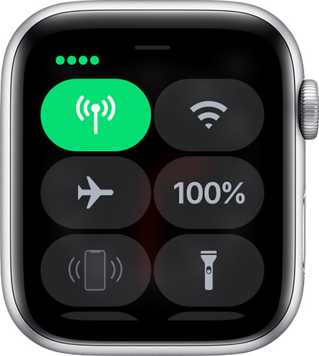
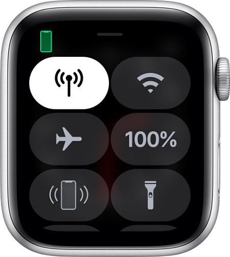

# Connect your Apple Watch to a cellular network

Your Apple Watch with cellular automatically switches to the most power-efficient wireless available.
It can connect to your iPhone when it's nearby, a Wi-Fi network, or cellular.
When your watch connects to cellular, it uses LTE networks. If LTE isn't available, your watch will try to connect to UMTS if your carrier supports it.
When your watch connects to a cellular network, you can check the signal strength from Control Center.

The Cellular button turns green when you have a connection.
The green dots show the signal strength.

The Cellular button turns white when your cellular plan is active, but your watch is connected to your iPhone using Bluetooth or Wi-Fi.

## Related

📌 [Use Control Center on your Apple Watch](use-control-center-on-your-apple-watch.md)

## Apple Support

🔗 [Set up cellular on Apple Watch](https://support.apple.com/en-us/HT207578)
