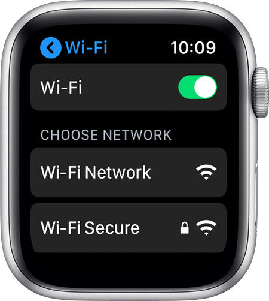

# Connect your Apple Watch to Wi-Fi

```{note}
If you have Apple Watch Series 6, you can connect to 2.4 GHz or 5 GHz Wi-Fi networks.
Apple Watch Series 5 and earlier, and Apple Watch SE, can only connect to 2.4 GHz Wi-Fi networks.
```

Open the Settings app on your Apple Watch

Tap **Wi-Fi** (*your device automatically searches for networks*)

Tap the name of the network that you want to join

If asked, enter the password using [Scribble](https://support.apple.com/kb/HT206907) or the Apple Watch keyboard

Tap **Join**



## Apple Support

🔗 [Connect your Apple Watch to Wi-Fi](https://support.apple.com/en-us/HT209071)
