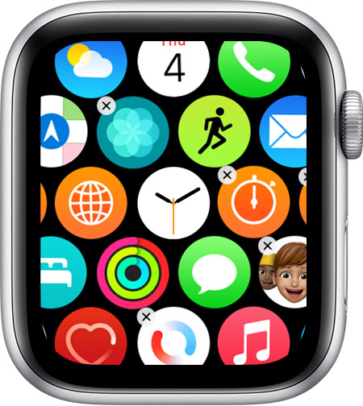

# Delete the CoPilot app on your Apple Watch

> :information_source:

Press the digital crown to see all your apps on the Home Screen

If your Home Screen is in grid view, touch and hold an app lightly until the app icons jiggle

- Tap the delete button on the app that you want to delete, then tap **Delete App**

If your Home screen is in list view, swipe left on the app that you want to delete, then tap the red delete button

Press the digital crown to finish

## Related

:paperclip: [Download the CoPilot app on your Apple Watch](download-the-copilot-app-on-your-apple-watch.md)

## Apple Support

:link: [Delete apps from your Apple Watch](https://support.apple.com/en-us/HT212064)
