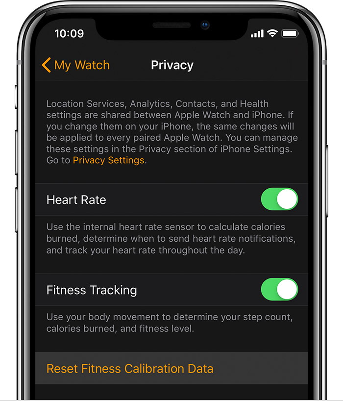

# Reset calibration data on your Apple Watch

- On your iPhone, open the Watch app

- Tap **My Watch** then tap **Privacy** → **Reset Fitness Calibration Data**

## Apple Support

🔗 [Calibrating your Apple Watch for improved Workout and Activity accuracy](https://support.apple.com/en-us/HT204516)
