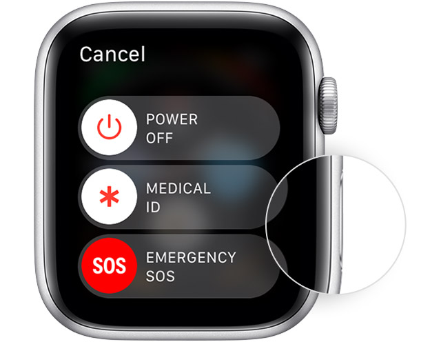

# Restart Apple Watch

> :information_source: If your Apple Watch is charging, take it off the charger first. When your watch is charging, you can't restart it.

Press and hold the side button until you see the **Power Off** slider

Drag the **Power Off** slider

After your watch turns off, press and hold the side button again until you see the Apple logo

## Apple Support

:link: [Restart your Apple Watch](https://support.apple.com/en-us/HT204510)
