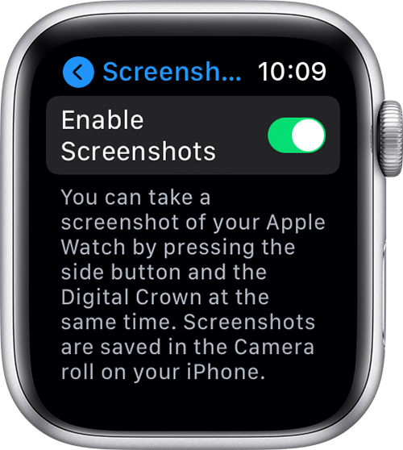

# Take a screenshot on Apple Watch

1. Open the Settings app on your Apple Watch

2. Tap **General**, then tap **Screenshots**

3. Turn on **Enable Screenshots**

4. With two fingers, press the digital crown and the side button at the same time (*the screen flashes when you take a screenshot*)

5. To find your screenshot, go to the Photos app on your iPhone

## Apple Support

:link: [Take a screenshot on Apple Watch](https://support.apple.com/en-us/HT204673)
