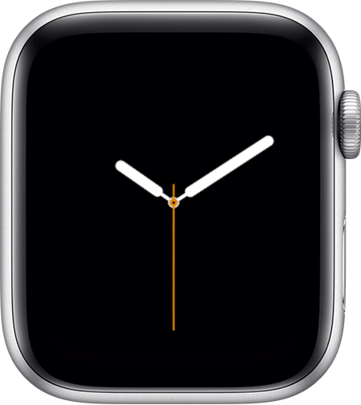

# Use Control Center on your Apple Watch

In the Control Center, you can see if your Apple Watch is connected to Wi-Fi, cellular, or your iPhone

**Open Control Center**

1. Touch and hold the bottom of the watch face

2. Wait for Control Center to show, then swipe up

**Close Control Center**

1. Swipe down from the top of the watch face, or press the digital crown

## Apple Support

:link: [Use Control Center on your Apple Watch](https://support.apple.com/en-us/HT206951)
