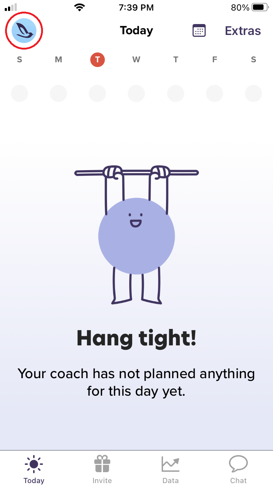

# Cancel your CoPilot Membership Plan

```{eval-rst}
.. include:: /apple.rst
```

---

- On your iPhone, open the CoPilot app

- Go to the **Today** tab, then tap your profile icon in the top left



&nbsp;

- Tap **Billing**


&nbsp;

- Tap **Cancel**


&nbsp;

- Provide a reason for canceling then tap **Submit Cancellation**

---

## Android

📌 [Cancel your CoPilot Membership Plan](android/cancel.md)

## Related

📌 [Pause your CoPilot Membership Plan](pause.md)
