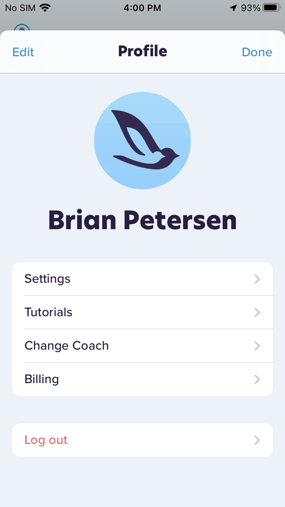
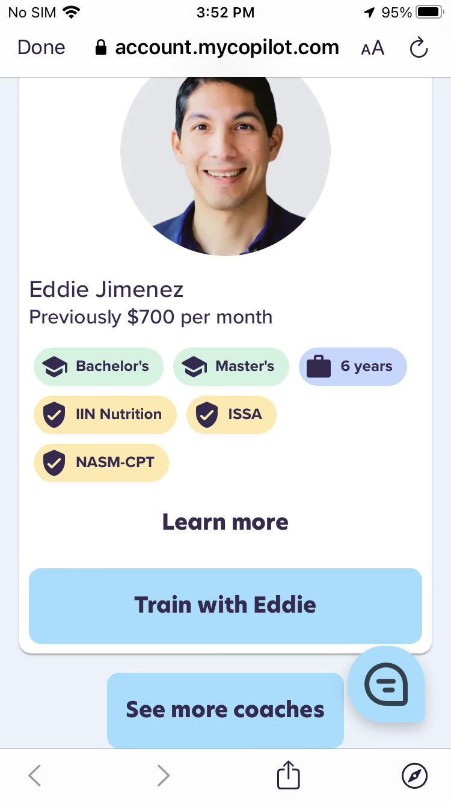
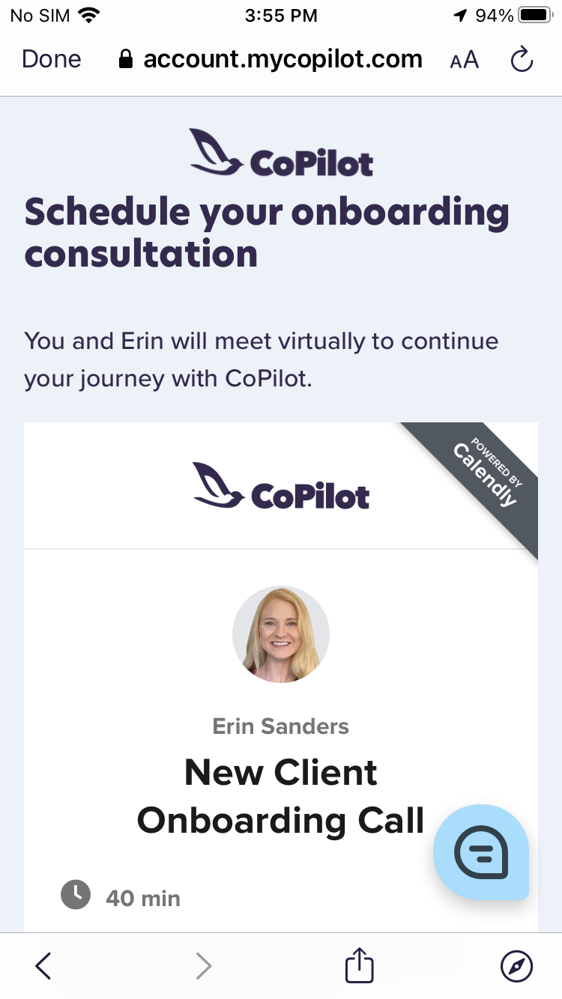
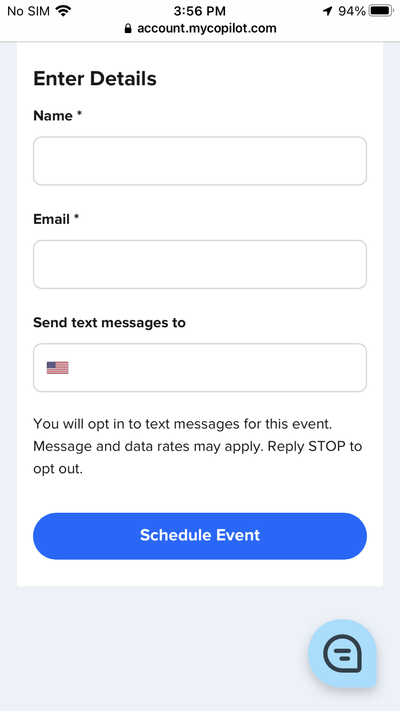

# Change Coach

> :information_source: You may change coaches at any time for any reason

On your iPhone, tap the CoPilot app icon

Go to the **Home** tab, then tap your profile icon in the top left

Tap **Change Coach**

Scroll to view a list of coaches

- If you want to load more coaches tap **See more coaches** at the bottom of the list

Tap **Learn more** to read a short bio of each coach

- Once you’ve made your selection, tap **Train with** to schedule an onboarding call

Select a date and time that works best for you

Input your name, email address and phone number then tap **Schedule Event**

A calendar invite will be sent to your email address

