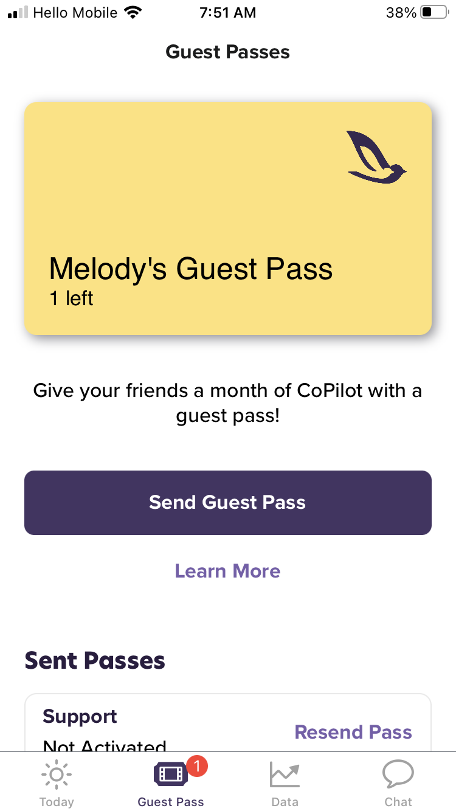
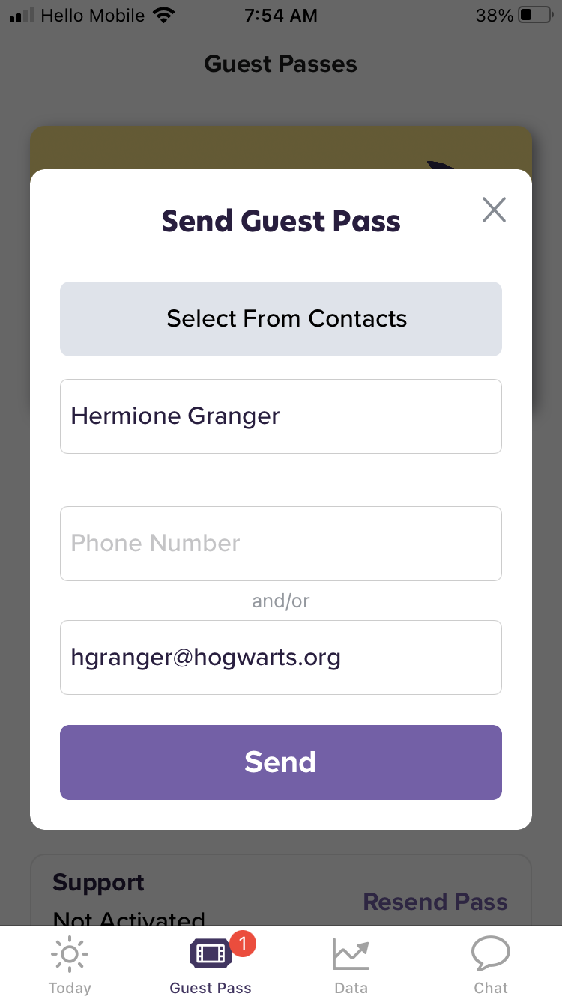

# Send a Guest Pass

```{note}
You earn 2 guest passes after completing your first two workouts, then 1 guest pass for every eight workouts completed
```

- On your iPhone, open the CoPilot app

- Go to the **Guest Pass** tab then tap **Send Guest Pass**



&nbsp;

- Enter the name, phone number and/or email address of your recipient

- To view your list of contacts tap **Select From Contacts**



&nbsp;

- Tap **Send**

- Recipients will receive an email message containing a special sign-up link (they must follow the link and complete the sign-up process to get a 30-day free trial)

```{warning}
Each Guest Pass is redeemable by one person only
```
