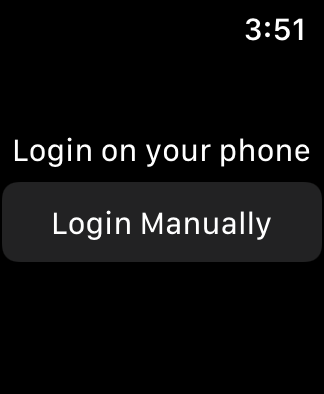
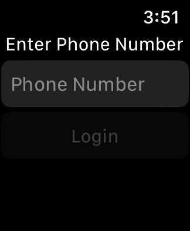
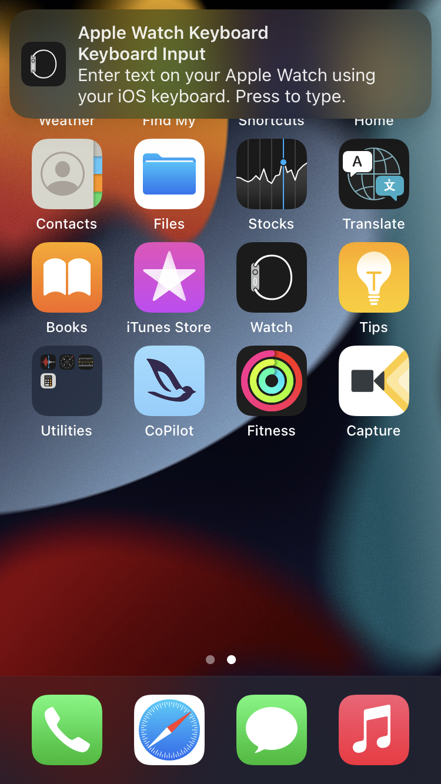
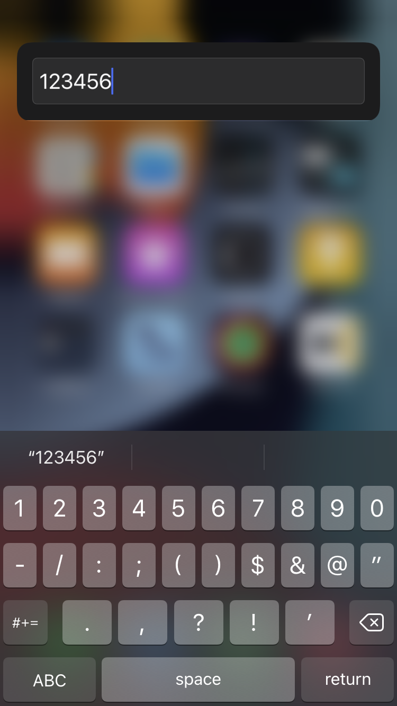
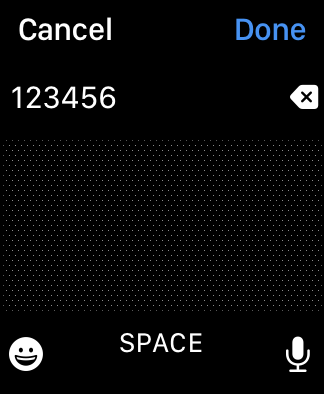

# Login to the CoPilot app on your Apple Watch

```{note}
The phone number used to login does not have to match your iPhone number; it must match the phone number used to sign-up
```

- On your Apple Watch, open the CoPilot app

- Tap **Login Manually**



- Tap **Phone Number** to initiate Keyboard Input on your iPhone



- On your iPhone, tap the Keyboard Input notification to display the keyboard



- Input the phone number you used to sign-up



- The numbers will appear on your Apple Watch



- Tap **Done** then tap **Login**

## Related

📌 [Login to the CoPilot app on your iPhone](login-to-the-copilot-app-on-your-iphone.md)
