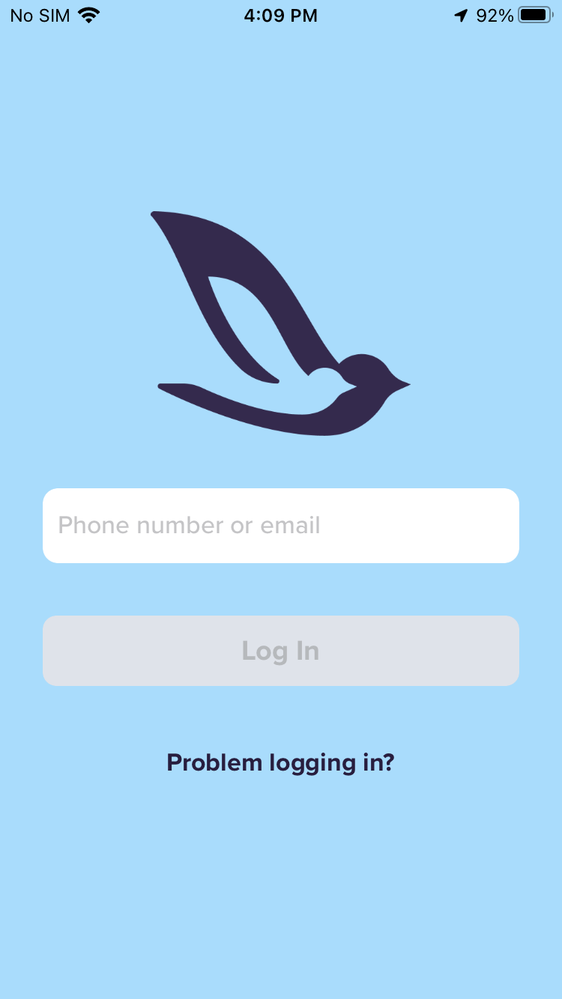
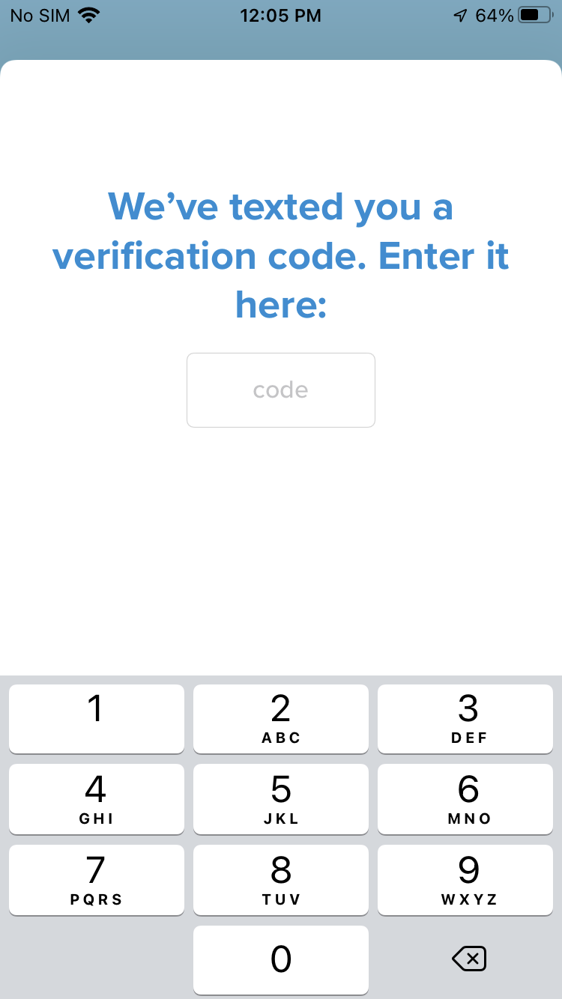

# Login to the CoPilot app on your iPhone

```{tip}
You may use either your phone number or email address to login
```

- On your iPhone, open the CoPilot app

- Input the phone number or email address used to sign-up, then tap **Log In**



- If you used your phone number to login, check the Messages app for a new text message

    - Input the 6-digit login code

- If you used your email to login, check your inbox for a new message from `info@mycopilot.com`

    - On your iPhone, tap the login link



```{error}
If you receive a **Login Issue** error message that says "*Couldn’t send verification code*" try adding your Country Code to the beginning of the phone number or try using your email address instead
```

## Related

📌 [Login to the CoPilot app on your Apple Watch](login-to-the-copilot-app-on-your-apple-watch.md)
