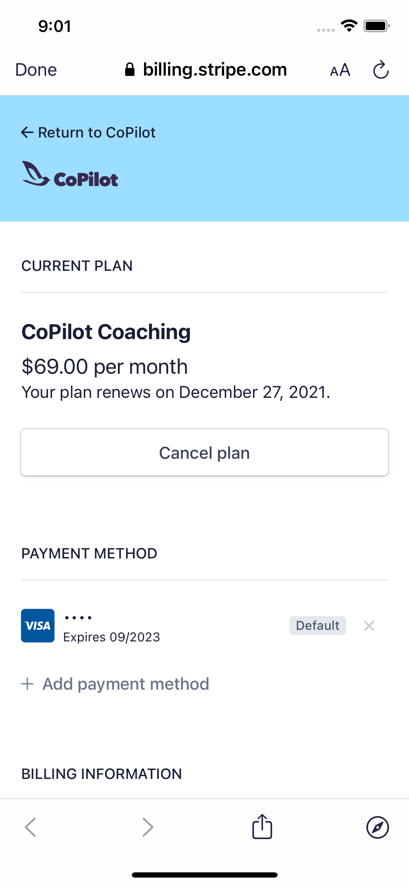
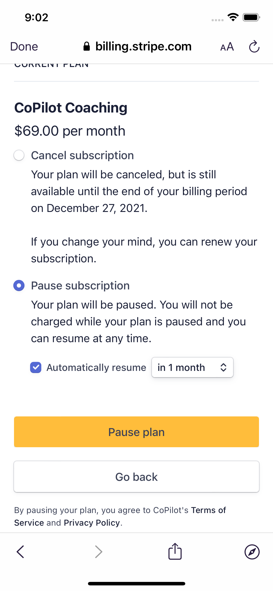

# Pause your CoPilot Membership Plan

- On your iPhone, open the CoPilot app

- Go to the **Today** tab, then tap your profile icon in the top left

&nbsp;

- Tap **Billing**

&nbsp;

- Tap **Cancel Plan**

&nbsp;

- The option to **Pause subscription** will appear

---

## Related

📌 [Cancel your CoPilot Membership Subscription](cancel-copilot.md)
