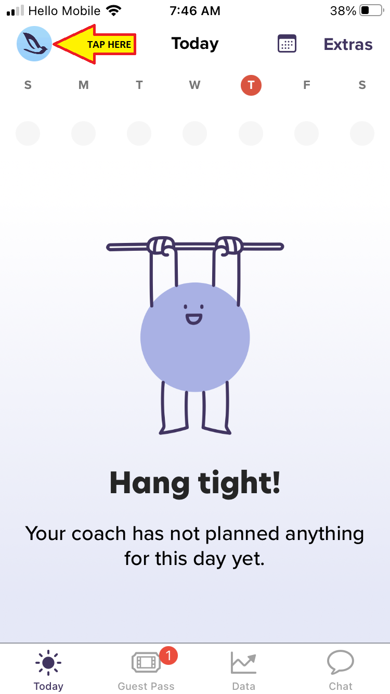
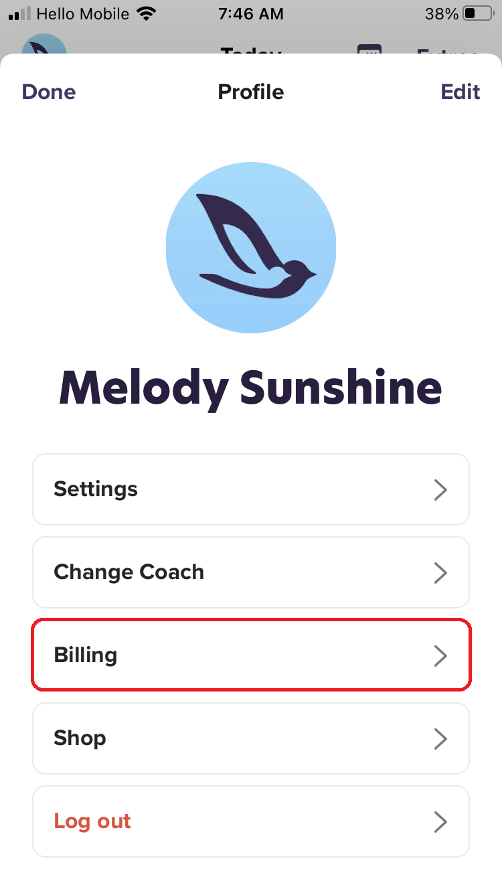
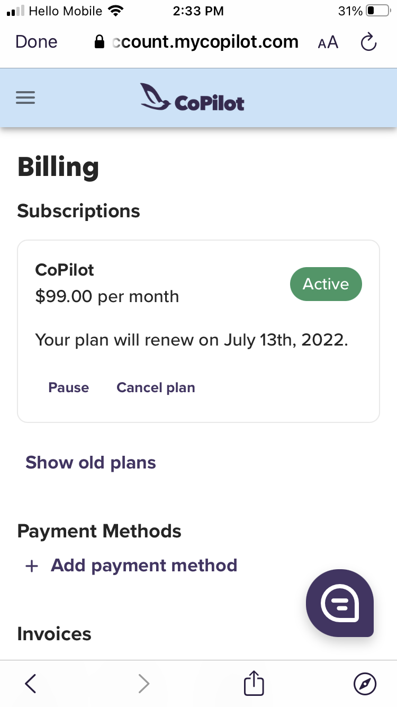

# Pause your CoPilot Membership Plan

- On your iPhone, open the CoPilot app

- Go to the **Today** tab, then tap your profile icon in the top left

&nbsp;

- Tap **Billing**

&nbsp;

- Tap **Pause**

&nbsp;

- Provide a reason for pausing, select the duration you would like to pause then tap **Pause**

---

## Related

📌 [Cancel your CoPilot Membership Subscription](cancel.md)
