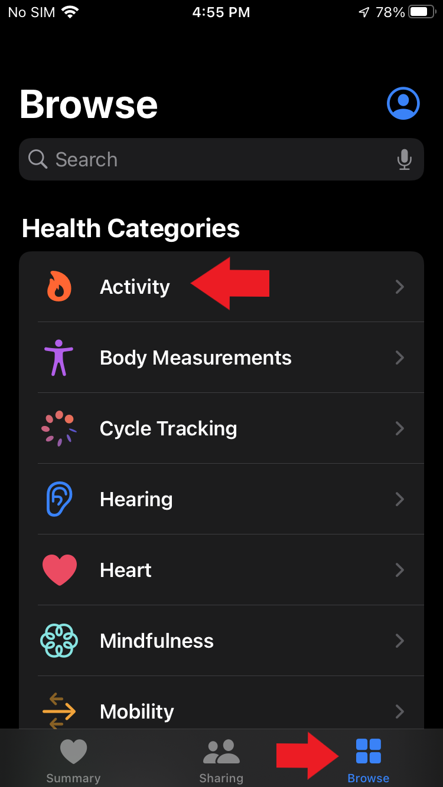
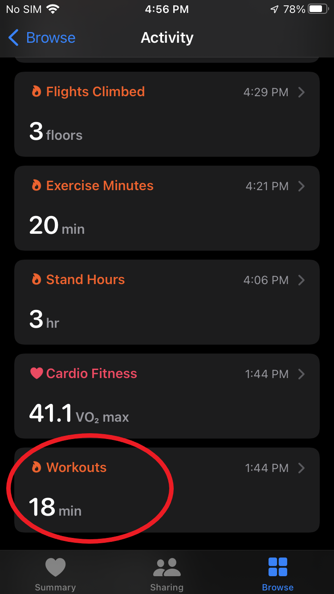
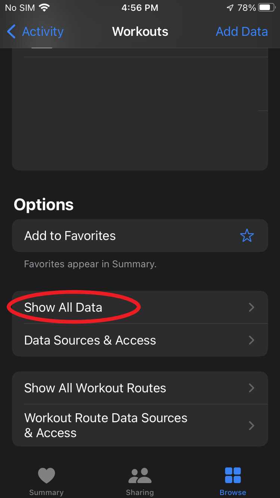
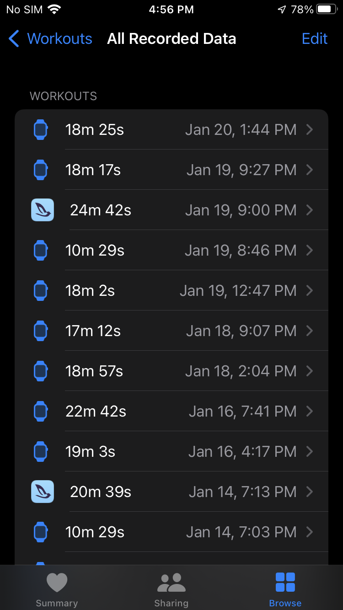
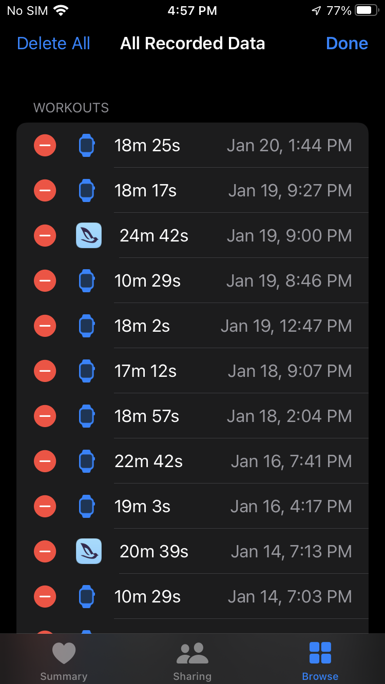

# Delete data from Apple Health app

On your iPhone, tap the Health app icon

Tap **Browse** then tap **Activity**

Tap **Workouts**

Scroll to the bottom of the screen and tap **Show All Data**

Scroll to find the erroneous workout

Tap **Edit**

Tap the red circle to delete a workout

Tap **Done**

## Apple Support

:link: [Use the Health app on your iPhone or iPod touch](https://support.apple.com/en-us/HT203037)
