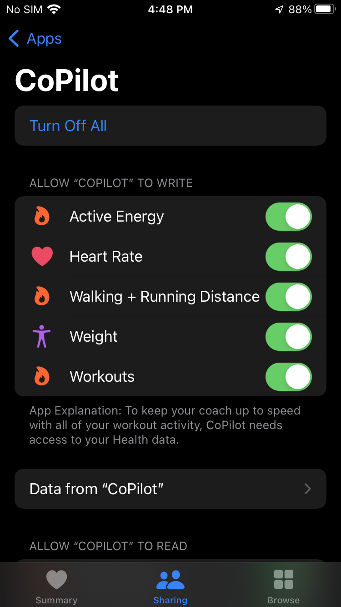
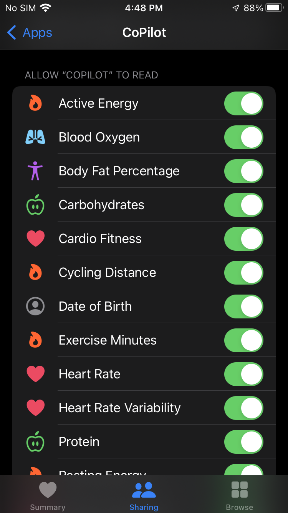

# Share health and fitness data with apps

You can give the CoPilot app permission to share health and fitness data with the Apple Health app.
For example, your CoPilot workout logs can appear in Health and contribute to your fitness activity.
The CoPilot app can also read workout data from other apps like the Apple Workout app, allowing your coach to see activity occurring outside the CoPilot app.

On your iPhone, tap the Health app icon

Tap your profile picture or initials at the top right

- If you don't see your profile picture or initials, tap **Summary** or **Browse** at the bottom of the screen, then scroll to the top of the screen

Below **Privacy**, tap **Apps**

To change access for CoPilot, tap it, then turn on or off permission to read/write data from Health

## Apple Support

:link: [Share your data in Health on iPhone](https://support.apple.com/guide/iphone/share-your-health-data-iph5ede58c3d/ios)

:link: [Use the Health app on your iPhone or iPod touch](https://support.apple.com/en-us/HT203037)

:link: [Use the Workout app on your Apple Watch](https://support.apple.com/en-us/HT204523)
