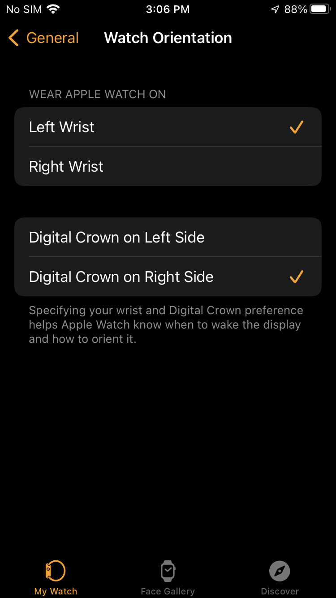
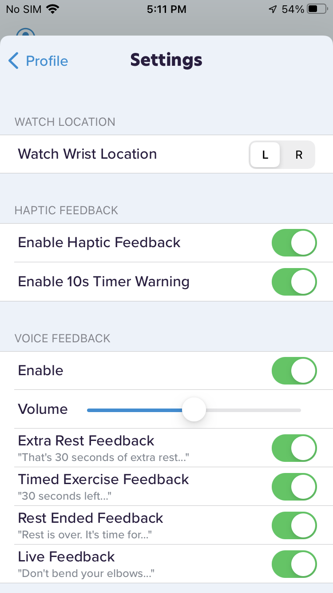

# Configuring Apple Watch Wrist Orientation

- On your iPhone, open the Watch app

- Tap **General** then tap **Watch Orientation**

- On your iPhone, open the CoPilot app

- Go to the **Home** tab, then tap your profile icon in the top left

- Tap **Settings** and toggle **Watch Wrist Location**

## Apple Support

🔗 [The Apple Watch app](https://support.apple.com/guide/watch/the-apple-watch-app-apd65b3ed73d/watchos)
