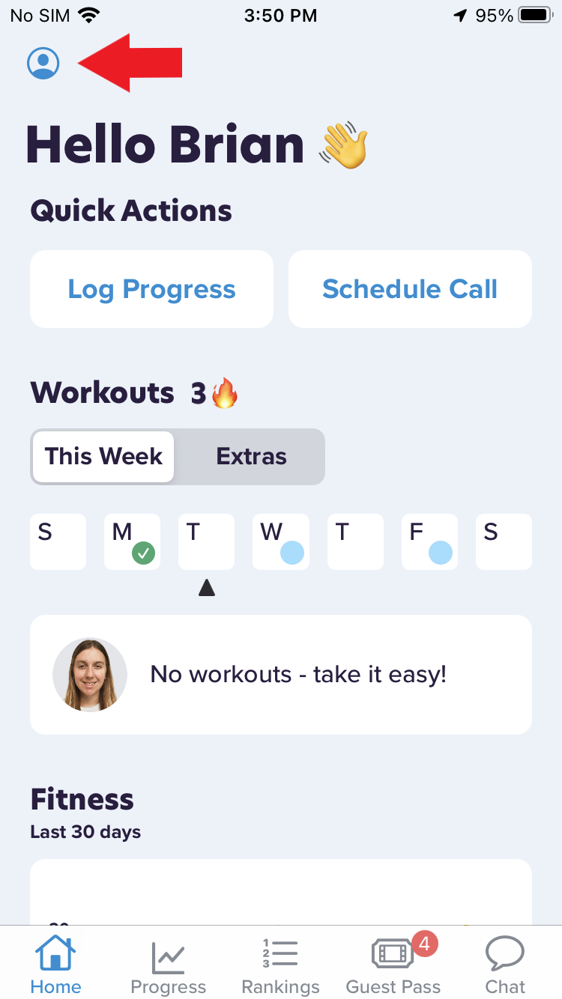
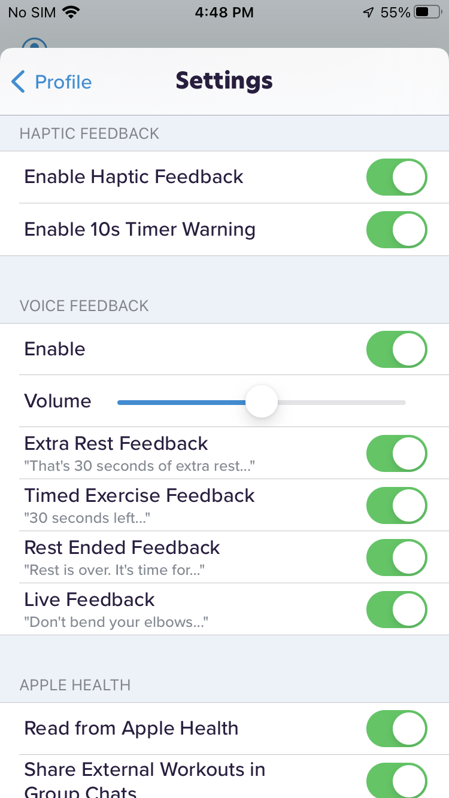

# Voice feedback is absent or inconsistent

On your iPhone, tap the CoPilot app icon

Go to the **Home** tab, then tap your profile icon in the top left

Tap **Settings** and toggle all options under *HAPTIC FEEDBACK* and *VOICE FEEDBACK*

